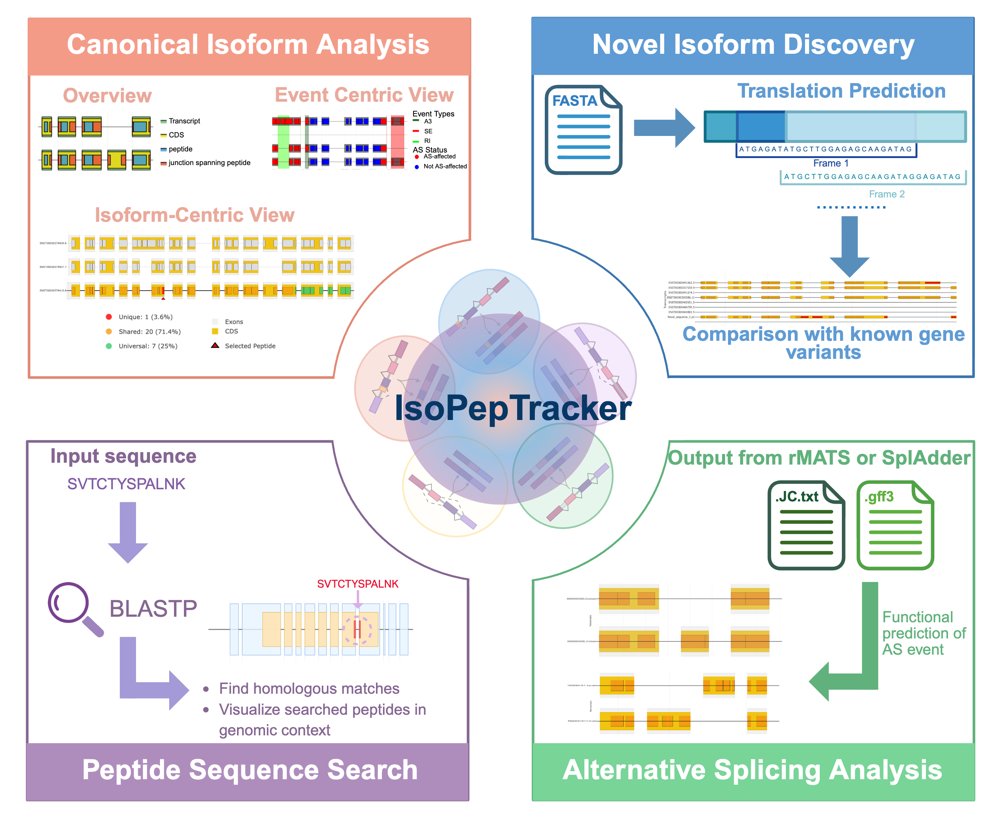

# IsoPepTracker




**A Shiny Application for Alternative Splicing Analysis and Peptide Mapping**

**IsoPepTracker** is a powerful bioinformatics tool designed to **visualize alternative splicing events**, **map peptides to genomic coordinates**, and **compare protein isoforms at the peptide level**. It provides interactive visualizations to explore how alternative splicing influences protein diversity and peptide generation under various proteolytic digestion conditions.

**Web Portal (recommended)**: [https://www.isopeptracker.org](https://www.isopeptracker.org)
**Tutorial & Documents**: [https://isopeptracker-docs.readthedocs.io/en/latest/](https://isopeptracker-docs.readthedocs.io/en/latest/)

---

## Table of Contents
- [Features](#features)
- [Local Installation and Setup (only if you want to run the tool in a local machine)]
  - [System Requirements](#system-requirements)
  - [Required R Packages](#required-r-packages)
  - [External Tools](#external-tools)
- [Required Database Files](#required-database-files)
  - [Critical Files (Required)](#critical-database-files-must-have)
  - [Optional (Performance)](#optional-performance-enhancements)
- [Usage](#usage)
  - [Starting the Application](#starting-the-application)
  - [Navigation](#navigation)
  - [Typical Workflow](#typical-workflow)
- [Input Data Formats](#input-data-formats)
  - [rMATS Output](#rmats-output-files)
  - [SplAdder Output](#spladder-output-files)
- [Getting Help](#getting-help)
- [Citation](#citation)
- [Acknowledgments](#acknowledgments)

---

## Features
- **Multi-Isoform Peptide Comparison**: Interactive comparison of peptides across multiple transcript isoforms
- **Alternative Splicing Visualization**: Visualize 5 AS event types (SE, A3SS, A5SS, MXE, RI) in canonical isoforms
- **Enzyme Digestion Simulation**: Analyze peptides from 6 proteases:
  - Trypsin
  - Chymotrypsin
  - AspN
  - LysC
  - LysN
  - GluC
- **Novel Isoform Analysis**: Identify and characterize novel peptides from alternative splicing
- **BLASTP Integration**: Search peptides against protein databases for functional annotation
- **AS Tool Support**: Process and visualize outputs from **rMATS** and **SplAdder**

## Local Installation and Setup (only if you want to run the tool in a local machine)

### System Requirements
- **R** ≥ 4.0
- **RStudio** 
- **RAM**: 8 GB minimum 
- **Disk**: 10 GB free space for databases and cache

### Required R Packages

Install CRAN and Bioconductor packages:

```r
# CRAN packages
install.packages(c(
  "shiny", "shinydashboard", "shinyjs", "shinycssloaders",
  "DT", "ggplot2", "plotly", "dplyr", "magrittr",
  "memoise", "promises", "future", "ggnewscale"
))

# Bioconductor packages
if (!require("BiocManager", quietly = TRUE))
    install.packages("BiocManager")

BiocManager::install(c(
  "rtracklayer",
  "GenomicRanges",
  "Biostrings",
  "BSgenome.Hsapiens.UCSC.hg38"
))

```

### External Tools

Install required external tools:

```bash
apt install minimap2 samtools transdecoder stringtie gffread ncbi-blast+
```

## Required Database Files

📁 **Database Download**: All required databases are available at:  
[Google Drive - IsoPepTracker Databases](https://drive.google.com/drive/folders/1oxmvASpP8WI61bY7jTn4t7y-vmdqtG9b?usp=sharing)

The application requires several pre-built database files to function properly:

#### 1. **Gene Index and Per-Gene Data**

- `data/index/gene_index.rds` - Gene index for fast gene lookup and navigation

- `data/genes/no_miss_cleavage/ENSG*.rds` - Per-gene peptide files (no missed cleavages)

- `data/genes/upto_two_misscleavage/ENSG*.rds` - Per-gene peptide files (up to 2 missed cleavages)

- `data/as_events/ENSG*.rds` - Alternative splicing events for each gene

- `data/gtf_cache/` - Pre-processed GTF cache directory 

- `data/gene_boundaries.rds` - Gene boundary coordinates database

#### 2. **Reference files**

-`reference/`- Reference files for BLAST and minimap2

#### 3. **rMATS-Specific Files**

- `rmats_peptide/real_cds_index.RDS` - CDS index for rMATS peptide mapping


## Usage

### Starting the Application

1. Ensure all required database files are in place
2. Open R or RStudio
3. Set your working directory to the IsoPepTracker folder
4. Run the application:

```R
# Option 1: Direct execution
shiny::runApp("app.R")

# Option 2: From RStudio
# Open app.R and click "Run App"

# Option 3: With specific options
shiny::runApp("app.R", host = "0.0.0.0", port = 3838)

```

### Navigation

The application features a card-based navigation system with the following main sections:

1. **Gene Overview**: Search and select genes, view basic statistics
2. **Multi-Isoform Comparison**: Compare peptides across transcript isoforms
3. **Alternative Splicing Analysis**: Visualize AS events and their peptide consequences
4. **Novel Isoform Analysis**: Analyze novel peptides from AS events
5. **Peptide Search**: BLASTP-based peptide searching
6. **rMATS Analysis**: Process and visualize rMATS output files
7. **SplAdder Analysis**: Process SplAdder predictions

### Typical Workflow

1. **Gene Selection**: Use the search box to find your gene of interest
2. **Choose Analysis Type**: Select between different analysis modules
3. **Configure Parameters**: 
   - Select protease (Trypsin, Chymotrypsin, etc.)
   - Choose miscleavage allowance (0 or up to 2)
   - Set visualization preferences
4. **Interactive Exploration**: Click, hover, and zoom on visualizations
5. **Export Results**: Download tables, plots, and analysis results


## Input Data Formats


### rMATS Output Files

The application accepts standard rMATS output files:

- Junction count files: `*.MATS.JC.txt`

- Supported event types: SE, A3SS, A5SS, MXE, RI


### SplAdder Output Files

- GFF3 format files from SplAdder

- Event types: exon_skip, alt_3prime, alt_5prime, intron_retention, mult_exon_skip, mutex_exons


### Getting Help

For issues, questions, or feature requests:

- Report issues at: https://github.com/HuangLabAtUAB/IsoPepTracker/issues

- Check existing issues for solutions

- Provide error messages and session info when reporting problems


## Citation

If you use IsoPepTracker in your research, please cite:

[IsoPepTracker: An interactive web application for peptide-driven isoform analysis, PLoS Comput Biol, 2026, PMID: 42234655](https://pubmed.ncbi.nlm.nih.gov/42234655/)

## Acknowledgments

Developed at the Huang Lab, University of Alabama at Birmingham.
